# Flussi utente — Admin, Merchant, Employee

Questo documento descrive **tutti i flussi implementati** delle tre applicazioni
della piattaforma, visti **dal punto di vista dell'utente**: cosa vede, cosa
sceglie, quali condizioni e gate incontra, e come si comportano i casi limite.

Per ogni schermata è presente una tabella **"Comandi e campi"** che elenca
**ogni bottone e ogni campo** dell'interfaccia, cosa fa, e quali **controlli**
vengono applicati — sia quelli mostrati subito a video (controlli *a video*),
sia quelli verificati dal sistema dopo l'invio (controlli *del sistema*).

> **Indice**
> 0. [Introduzione](#0-introduzione)
> 1. [Autenticazione e accesso](#1-autenticazione-e-accesso)
> 2. [RBAC, ruoli e gate di accesso](#2-rbac-ruoli-e-gate-di-accesso)
> 3. [App Admin](#3-app-admin)
> 4. [Filiali e reparti (Merchant)](#4-filiali-e-reparti-merchant)
> 5. [Mansioni / competenze (Merchant)](#5-mansioni--competenze-merchant)
> 6. [Risorse / dipendenti (Merchant)](#6-risorse--dipendenti-merchant)
> 7. [Ruoli (Merchant)](#7-ruoli-merchant)
> 8. [Eventi e turni](#8-eventi-e-turni)
> 9. [Flussi approvativi: richieste](#9-flussi-approvativi-richieste)
> 9-bis. [Conflitti tra azioni di attori diversi](#9-bis-conflitti-tra-azioni-di-attori-diversi)
> 10. [Timbratura](#10-timbratura)
> 11. [Magazzino](#11-magazzino)
> 12. [Notifiche (Employee)](#12-notifiche-employee)
> 13. [Elementi comuni di navigazione](#13-elementi-comuni-di-navigazione)
> 14. [Appendici](#14-appendici)

---

## 0. Introduzione

La piattaforma è un **gestionale aziendale** per la pianificazione di turni ed
eventi, la gestione del personale multi-filiale e la timbratura. Tre tipi di
utente, ciascuno con la propria applicazione web:

| Utente | App | Chi è |
|--------|-----|-------|
| **Admin** | App Admin | Gestore della piattaforma: supervisiona le aziende iscritte. |
| **Merchant** | App Merchant | L'azienda cliente: pianifica turni, gestisce filiali, reparti, dipendenti. |
| **Employee** | App Employee | Il dipendente: consulta i propri turni, timbra, invia richieste. |

### Gerarchia organizzativa

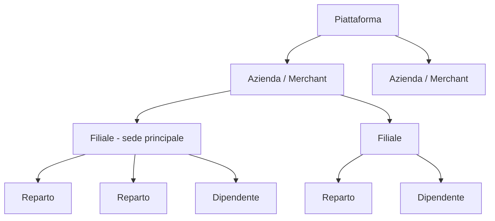

Un'**azienda** ha una o più **filiali** (la prima è la *sede principale*). Ogni
filiale può avere **reparti**. Un **dipendente** è associato a un'azienda con un
ruolo e una filiale "di appartenenza"; uno stesso dipendente può appartenere a
più aziende.

### Mappa degli attori e dei flussi approvativi

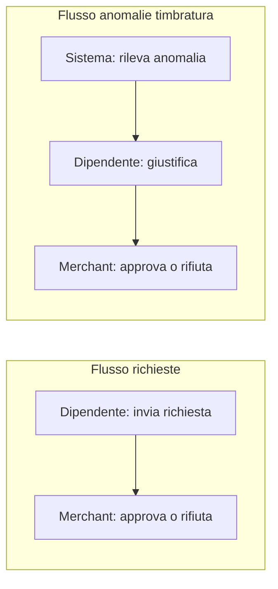

### Legenda dei gate e dei controlli

| Simbolo | Significato |
|---------|-------------|
| ✅ | **Condizione richiesta** perché l'azione vada a buon fine. |
| ⛔ | **Gate bloccante**: se non rispettato l'azione viene rifiutata. |
| ⚠️ | **Warning non bloccante**: il sistema segnala ma lascia procedere. |
| ℹ️ | **Nota di trasparenza**: opzione presente ma con effetto oggi limitato. |

Nelle tabelle "Comandi e campi", i controlli sono divisi in:

- **Controllo a video** — verifica fatta subito dall'interfaccia (campo
  obbligatorio, formato, pulsante disattivato finché qualcosa manca).
- **Controllo del sistema** — verifica fatta dopo l'invio dei dati; se fallisce,
  l'azione è rifiutata e compare un messaggio d'errore.

---

## 1. Autenticazione e accesso

Ogni app ha le proprie schermate di accesso. Le credenziali sono **email +
password**; un account è utilizzabile solo se **attivo**.

### 1.1 Login (Admin / Merchant / Employee)

Le tre app hanno una schermata di login analoga.

**Comandi e campi — schermata di Login**

| Elemento | Tipo | Cosa fa | Controlli |
|----------|------|---------|-----------|
| Email | Campo testo | Indirizzo dell'account. | A video: obbligatorio, formato email. |
| Password | Campo password | Password dell'account. | A video: obbligatorio. |
| Accedi / Sign in | Bottone | Invia le credenziali ed entra. | Disattivato durante l'invio. Sistema: credenziali corrette ⛔, account attivo ⛔, tipo account corretto per l'app ⛔ (in Admin, se l'account non è admin compare "Accesso riservato agli amministratori"). |
| Password dimenticata? | Link | Va alla schermata di recupero password. | — |
| Registrati | Link | Va alla registrazione (solo Merchant ed Employee). | — |
| System Status / Ping (solo Admin) | Pannello | Mostra l'indirizzo dell'API e verifica che sia raggiungibile. | — |

In caso di errore compare un messaggio ("Credenziali non valide" / "Email o
password non validi").

### 1.2 Registrazione azienda (Merchant)

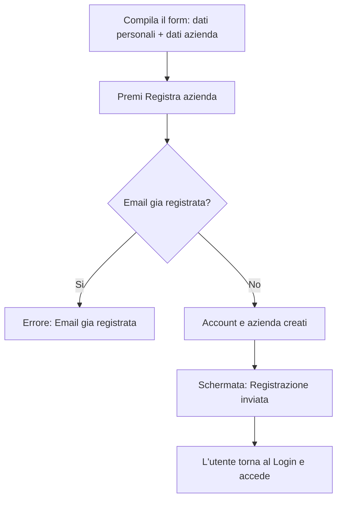

> Dopo la registrazione **non** si entra automaticamente: compare la conferma
> *"Registrazione inviata. L'account sarà attivato dall'amministratore"* e si
> torna al login. Alla creazione il sistema predispone in automatico la **sede
> principale**, il ruolo **"Responsabile App"** (tutte le funzioni) e il profilo
> **dipendente** del titolare. L'azienda nasce *in attesa di approvazione* ma
> può comunque operare una volta effettuato il login.

**Comandi e campi — Registrazione azienda**

| Elemento | Tipo | Cosa fa | Controlli |
|----------|------|---------|-----------|
| Nome | Campo testo | Nome del titolare. | A video: obbligatorio. |
| Cognome | Campo testo | Cognome del titolare. | A video: obbligatorio. |
| Email | Campo testo | Email dell'account aziendale. | A video: obbligatorio, formato email. Sistema: non già registrata ⛔. |
| Password | Campo password | Password dell'account. | A video: obbligatorio, minimo 6 caratteri. |
| Ragione Sociale | Campo testo | Nome dell'azienda. | A video: obbligatorio. |
| Partita IVA | Campo testo | P. IVA dell'azienda. | A video: obbligatorio. |
| Città | Campo testo | Città dell'azienda. | A video: obbligatorio. |
| Indirizzo | Campo testo | Indirizzo dell'azienda. | A video: obbligatorio. |
| Registra Azienda | Bottone | Invia la registrazione. | Disattivato durante l'invio. |
| Accedi | Link | Torna al login. | — |

### 1.3 Registrazione dipendente (Employee)

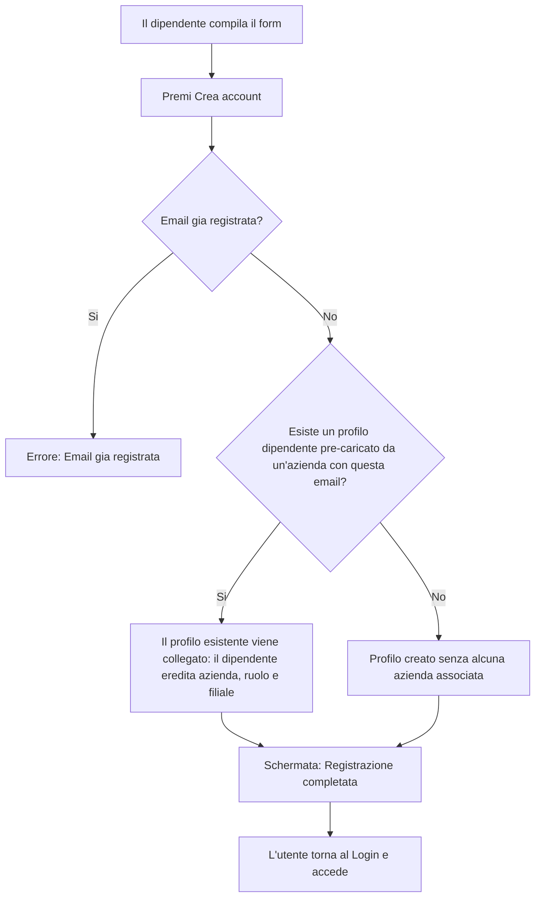

> Come per il Merchant, **non** c'è login automatico: compare *"Account creato
> con successo. Puoi ora accedere"*.

**Comandi e campi — Registrazione dipendente**

| Elemento | Tipo | Cosa fa | Controlli |
|----------|------|---------|-----------|
| Nome | Campo testo | Nome del dipendente. | A video: obbligatorio. |
| Cognome | Campo testo | Cognome del dipendente. | A video: obbligatorio. |
| Email | Campo testo | Email dell'account. | A video: obbligatorio, formato email. Sistema: non già registrata ⛔. |
| Password | Campo password | Password dell'account. | A video: obbligatorio, minimo 8 caratteri. |
| Telefono | Campo testo | Recapito (facoltativo). | — |
| Crea account | Bottone | Invia la registrazione. | Disattivato durante l'invio. |
| Accedi | Link | Torna al login. | — |

### 1.4 Selezione azienda (Employee multi-azienda)

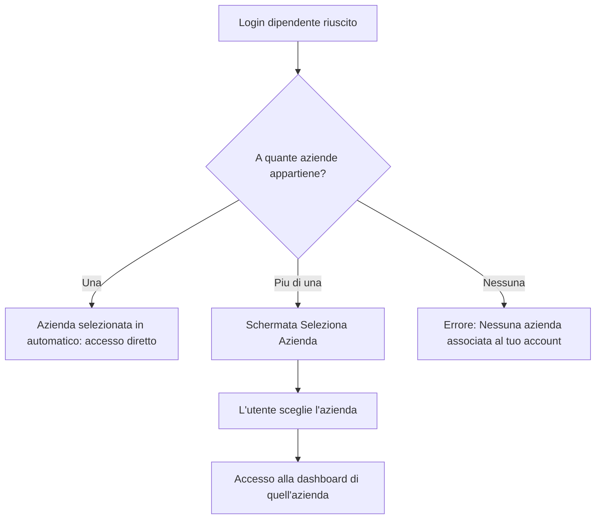

**Comandi e campi — Seleziona Azienda**

| Elemento | Tipo | Cosa fa | Controlli |
|----------|------|---------|-----------|
| Scheda azienda | Bottone | Entra nel contesto di quell'azienda (con le funzioni del ruolo lì assegnato). | Sistema: la membership a quell'azienda deve essere attiva ⛔. Le schede mostrano nome, città e ruolo. |
| Esci dall'account | Bottone | Effettua il logout. | — |

Per cambiare azienda più tardi si usa **"Cambia azienda"** nella barra laterale
(vedi [§13](#13-elementi-comuni-di-navigazione)).

### 1.5 Recupero password

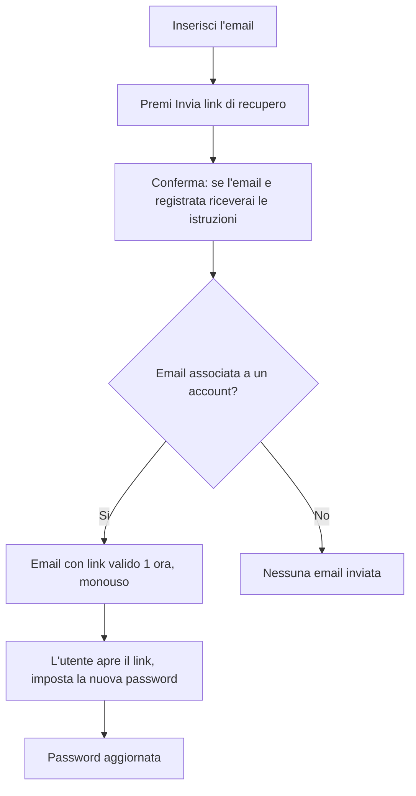

**Comandi e campi — Password dimenticata**

| Elemento | Tipo | Cosa fa | Controlli |
|----------|------|---------|-----------|
| Email | Campo testo | Email per cui richiedere il reset. | A video: obbligatorio, formato email. |
| Invia link di recupero | Bottone | Richiede l'invio del link. | Disattivato durante l'invio. Sistema: la conferma è **sempre la stessa**, esista o meno l'account. |
| Invia di nuovo | Bottone | Richiede un nuovo link. | Disponibile solo dopo un'**attesa di 60 secondi** (countdown a video). |
| Torna al login | Link | Torna al login. | — |

**Comandi e campi — Nuova password (reset)**

| Elemento | Tipo | Cosa fa | Controlli |
|----------|------|---------|-----------|
| Nuova password | Campo password | La nuova password. | A video: obbligatorio, minimo 8 caratteri. |
| Conferma password | Campo password | Ripetizione della password. | A video: deve coincidere con la nuova password ⛔. |
| Aggiorna password | Bottone | Invia la nuova password. | Sistema: il link deve essere valido, non scaduto (1 ora) e non già usato ⛔. |

Se il link nell'indirizzo manca o è incompleto, la schermata mostra *"Link non
valido"* con il rimando per richiederne uno nuovo.

### Corner case — Autenticazione

| Situazione | Comportamento |
|------------|---------------|
| Email già registrata in fase di registrazione | Registrazione rifiutata. |
| Account disattivato | Login negato anche con password corretta. |
| Link di reset scaduto o già usato | Reset rifiutato, va richiesto un nuovo link. |
| Dipendente senza alcuna azienda attiva | Il login mostra "Nessuna azienda associata". |
| Dipendente con azienda disattivata | Quell'azienda non compare nella selezione. |

---

## 2. RBAC, ruoli e gate di accesso

L'accesso alle funzioni dipende dal **ruolo** del dipendente nell'azienda.
Esistono **10 funzioni** assegnabili: Calendario, Richieste, Risorse, Ruoli,
Documenti, Report, Mansioni, Filiali, Timbratura, Magazzino.

### 2.1 Come i gate appaiono all'utente

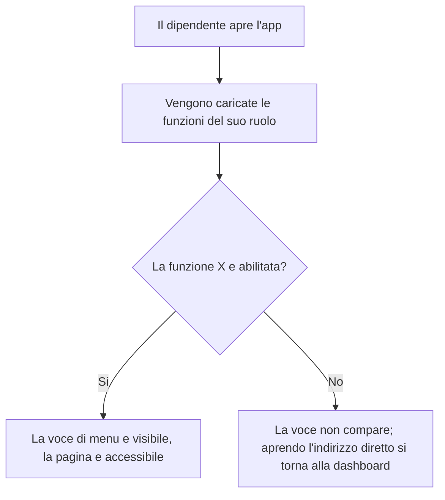

- Il **Merchant** (titolare) vede tutte le funzioni.
- L'**Employee** vede **solo le voci di menu** abilitate dal proprio ruolo;
  tentando di aprire una pagina non abilitata viene **riportato alla
  dashboard** ⛔.
- **Dashboard** e **Notifiche** sono sempre accessibili al dipendente.

### 2.2 Ruolo di default "Responsabile App"

Creato alla nascita dell'azienda: ha **tutte le funzioni**, è **non
eliminabile** e i suoi interruttori **non sono modificabili** (vedi
[§7](#7-ruoli-merchant)).

### Tabella riassuntiva — funzioni e gate

| Funzione | Cosa abilita | Se non abilitata per il dipendente |
|----------|--------------|-------------------------------------|
| Calendario | Vista dei propri turni ed eventi | Voce assente, pagina non raggiungibile |
| Richieste | Invio e storico richieste | Voce assente |
| Risorse | Gestione dei dipendenti | Voce assente |
| Ruoli | Gestione dei ruoli aziendali | Voce assente |
| Documenti | Documenti HR | Voce assente |
| Report | Reportistica | Voce assente |
| Mansioni | Gestione delle mansioni | Voce assente |
| Filiali | Gestione di filiali e reparti | Voce assente |
| Timbratura | Timbratura e storico | Voce assente |
| Magazzino | Articoli, stock, fornitori, ordini acquisto e ricezioni | Voce assente |

---

## 3. App Admin

L'App Admin supervisiona la piattaforma. È un account unico, senza ruoli interni.

### 3.1 Dashboard Admin

Mostra il riepilogo della piattaforma e le aziende in attesa di approvazione.

**Comandi e campi — Dashboard Admin**

| Elemento | Tipo | Cosa fa | Controlli |
|----------|------|---------|-----------|
| Schede statistiche | Riquadri | Totale aziende, aziende attive, in attesa, dipendenti totali. | Sola lettura. |
| Approve | Bottone (per azienda in attesa) | Approva l'azienda. | Disattivato durante l'operazione. |
| Reject | Bottone (per azienda in attesa) | Rifiuta/disattiva l'azienda. | Disattivato durante l'operazione. |
| View all merchants | Link | Apre l'elenco completo delle aziende. | — |

### 3.2 Elenco aziende (Merchants)

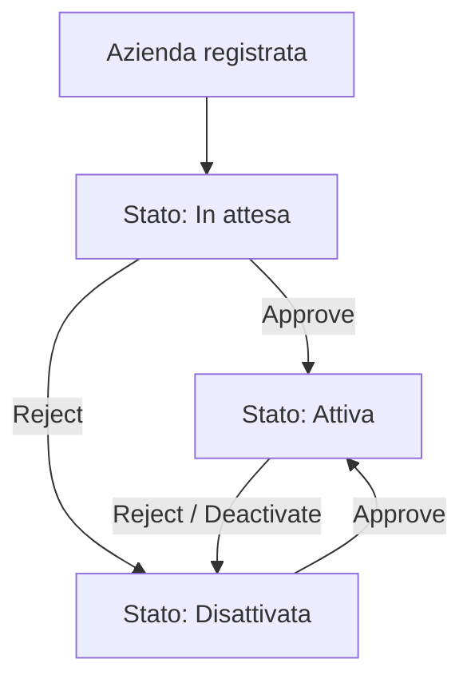

Ogni azienda ha uno di tre stati: **In attesa**, **Attiva**, **Disattivata**.

**Comandi e campi — Elenco aziende**

| Elemento | Tipo | Cosa fa | Controlli |
|----------|------|---------|-----------|
| Tab All / Pending / Active / Inactive | Filtri | Filtra l'elenco per stato. | — |
| Bottone "occhio" (View details) | Bottone riga | Apre il dettaglio dell'azienda. | — |
| Bottone "spunta" (Approve) | Bottone riga | Approva l'azienda. | Visibile solo se l'azienda non è già attiva. |
| Bottone "X" (Reject / Deactivate) | Bottone riga | Rifiuta o disattiva l'azienda. | Visibile solo se l'azienda non è già disattivata. |

### 3.3 Dettaglio azienda

**Comandi e campi — Dettaglio azienda**

| Elemento | Tipo | Cosa fa | Controlli |
|----------|------|---------|-----------|
| Back to Merchants | Link | Torna all'elenco. | — |
| Approve | Bottone | Approva l'azienda. | Visibile solo se non già attiva. |
| Deactivate | Bottone | Disattiva l'azienda. | Visibile solo se non già disattivata. |
| Edit | Bottone | Entra in modalità modifica dei dati azienda. | — |
| Campi azienda (Ragione sociale, P. IVA, Città, Indirizzo, Telefono, Email aziendale) | Campi testo (in modifica) | Modificano i dati dell'azienda. | — |
| Save changes | Bottone | Salva le modifiche. | Disattivato durante il salvataggio. |
| Cancel | Bottone | Annulla la modifica. | — |

La scheda mostra anche i dati del titolare e i conteggi di dipendenti e filiali
(sola lettura).

### 3.4 Strumenti Admin

- **Email Test** — verifica la configurazione del servizio email e invia
  un'email di prova.
- **Debug** — pannello tecnico con controlli di raggiungibilità dell'API.

**Comandi e campi — Email Test**

| Elemento | Tipo | Cosa fa | Controlli |
|----------|------|---------|-----------|
| Aggiorna (stato servizio) | Bottone | Ricarica lo stato del servizio email. | — |
| Destinatario | Campo testo | Indirizzo a cui inviare l'email di prova. | A video: formato email valido; se non valido compare "Indirizzo email non valido". |
| Invia test | Bottone | Invia l'email di prova. | Disattivato se il servizio non è configurato o l'indirizzo non è valido. |

**Comandi e campi — Debug**

| Elemento | Tipo | Cosa fa | Controlli |
|----------|------|---------|-----------|
| Run checks | Bottone | Esegue i controlli di raggiungibilità dell'API. | — |
| Aggiorna (Email Service) | Bottone | Ricarica lo stato del servizio email. | — |
| Vai al test email | Link | Apre la pagina Email Test. | — |
| Copia (⎘) | Bottone | Copia negli appunti un valore tecnico. | — |

> ℹ️ Le voci **Users** e **Reports** dell'App Admin sono attualmente
> **segnaposto** ("In development" / "Coming soon"): non offrono ancora azioni.

---

## 4. Filiali e reparti (Merchant)

### 4.1 Pagina Filiali

Se l'azienda ha **una sola filiale**, la pagina mostra un invito a configurarne
altre; con **più filiali** mostra l'elenco delle filiali con i loro reparti.

**Comandi e campi — Pagina Filiali**

| Elemento | Tipo | Cosa fa | Controlli |
|----------|------|---------|-----------|
| + Nuova filiale | Bottone | Apre il modale di creazione filiale. | — |
| Configura le filiali | Bottone | Avvia il wizard guidato (azienda mono-sede). | — |
| Imposta come sede principale | Bottone (per filiale) | Promuove la filiale a sede principale. | Visibile solo per filiali non-HQ e attive. Sistema: una filiale disattivata non può diventare HQ ⛔. |
| Modifica | Bottone (per filiale) | Apre il modale di modifica filiale. | — |
| Elimina | Bottone (per filiale) | Elimina la filiale. | Visibile solo per filiali non-HQ. Chiede conferma. Sistema: blocca se è l'unica filiale ⛔, se ha turni associati ⛔ o se è sede primaria di dipendenti ⛔. |
| + Reparto | Bottone (per filiale) | Apre il modale di creazione reparto. | — |
| ✎ (su reparto) | Bottone | Apre il modale di modifica reparto. | — |
| ✕ (su reparto) | Bottone | Elimina il reparto. | Chiede conferma; turni e dipendenti collegati restano "senza reparto". |

### 4.2 Wizard "Configura le filiali"

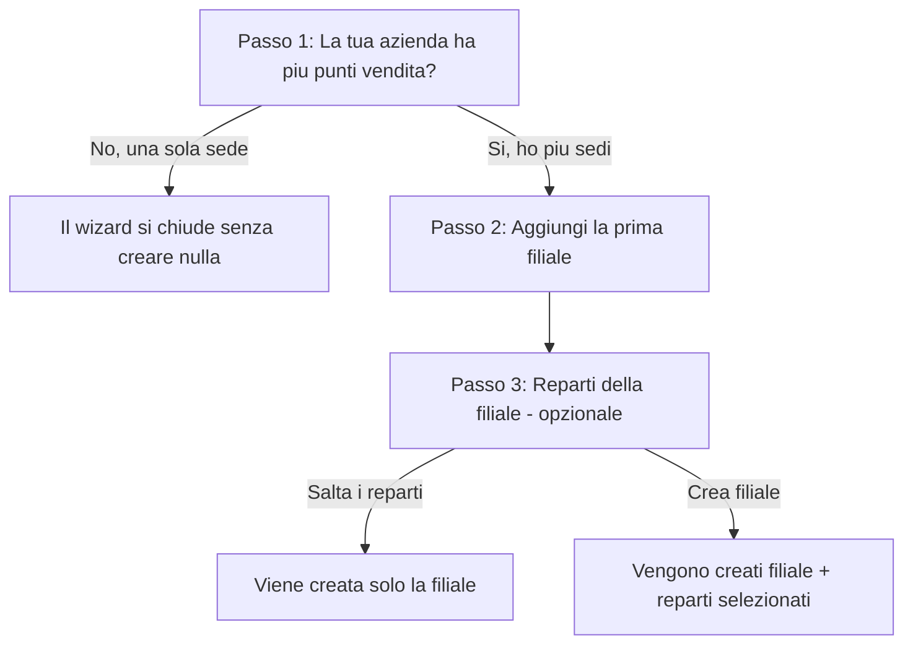

**Comandi e campi — Wizard filiali**

| Elemento | Passo | Cosa fa | Controlli |
|----------|-------|---------|-----------|
| Sì, ho più sedi | 1 | Prosegue al passo 2. | — |
| No, una sola sede | 1 | Chiude il wizard senza creare nulla. | — |
| Nome filiale | 2 | Nome della nuova filiale. | A video: obbligatorio (gate sul pulsante Avanti). |
| Città | 2 | Città della filiale (facoltativa). | — |
| Indietro / Avanti | 2 | Naviga tra i passi. | "Avanti" disattivato finché il nome è vuoto. |
| Chip preset reparto | 3 | Seleziona/deseleziona un reparto suggerito (Produzione, Amministrazione, Magazzino, Vendita, Cassa). | — |
| Campo reparto personalizzato + Aggiungi | 3 | Aggiunge un reparto con nome libero. | — |
| Salta i reparti | 3 | Crea solo la filiale. | — |
| Crea filiale | 3 | Crea filiale + reparti selezionati. | Disattivato durante il salvataggio. Sistema: nome filiale obbligatorio ⛔, nome non duplicato ⛔. |

> **Corner case del wizard**: se la filiale viene creata ma un reparto fallisce,
> l'operazione è considerata riuscita parzialmente — il wizard si chiude (per
> non creare filiali doppione) e i reparti mancanti si aggiungono poi a mano.

### 4.3 Modale Filiale

**Comandi e campi — Modale Nuova/Modifica filiale**

| Elemento | Tipo | Cosa fa | Controlli |
|----------|------|---------|-----------|
| Nome | Campo testo | Nome della filiale. | A video: obbligatorio. Sistema: obbligatorio ⛔, non duplicato nell'azienda ⛔. |
| Codice | Campo testo | Codice interno (facoltativo). | — |
| Città | Campo testo | Città della filiale. | — |
| Dettagli opzionali (Indirizzo, CAP, Paese, Telefono) | Campi testo | Dati aggiuntivi della filiale. | — |
| Filiale attiva | Casella | Attiva/disattiva la filiale (solo in modifica, non per la HQ). | Sistema: non si può disattivare la HQ ⛔ né l'unica filiale attiva ⛔. |
| Annulla / Salva | Bottoni | Annulla o salva. | "Salva" disattivato durante il salvataggio. |

### 4.4 Modale Reparto

**Comandi e campi — Modale Nuovo/Modifica reparto**

| Elemento | Tipo | Cosa fa | Controlli |
|----------|------|---------|-----------|
| Nome | Campo testo | Nome del reparto. | A video: obbligatorio. Sistema: obbligatorio ⛔, non duplicato nella filiale ⛔. |
| Colore | Tavolozza | Colore identificativo del reparto. | — |
| Reparto attivo | Casella | Attiva/disattiva il reparto (solo in modifica). | — |
| Annulla / Salva | Bottoni | Annulla o salva. | "Salva" disattivato durante il salvataggio. |

---

## 5. Mansioni / competenze (Merchant)

Una **mansione** descrive un ruolo operativo (es. Cassiere, Repartista).

### 5.1 Pagina Mansioni

**Comandi e campi — Pagina Mansioni**

| Elemento | Tipo | Cosa fa | Controlli |
|----------|------|---------|-----------|
| + Nuova mansione / Crea la prima mansione | Bottone | Apre il modale di creazione. | — |
| Scheda mansione (area superiore) | Bottone | Apre il pannello laterale con i dipendenti che possiedono la mansione. | — |
| Modifica | Bottone (per mansione) | Apre il modale di modifica. | — |
| Elimina | Bottone (per mansione) | Elimina la mansione. | Chiede conferma. |

**Comandi e campi — Modale Nuova/Modifica mansione**

| Elemento | Tipo | Cosa fa | Controlli |
|----------|------|---------|-----------|
| Nome | Campo testo | Nome della mansione. | A video: obbligatorio. |
| Colore | Tavolozza | Colore del badge. | — |
| Attiva | Casella | Se attiva, la mansione è selezionabile nelle assegnazioni. | — |
| Annulla / Salva | Bottoni | Annulla o salva. | "Salva" disattivato durante il salvataggio. |

Il pannello laterale "Dipendenti con questa mansione" è in sola lettura e rinvia
a **Risorse** per assegnare la mansione.

---

## 6. Risorse / dipendenti (Merchant)

### 6.1 Pagina Risorse

Elenca i dipendenti dell'azienda con ruolo, sede, mansioni e stato.

**Comandi e campi — Pagina Risorse**

| Elemento | Tipo | Cosa fa | Controlli |
|----------|------|---------|-----------|
| + Aggiungi Dipendente | Bottone | Apre il modale di creazione dipendente. | — |
| Chip "Filtra per filiale" | Filtri | Mostra solo i dipendenti di una filiale (compare con più filiali). | — |
| Chip "Filtra per mansione" | Filtri | Mostra solo i dipendenti con una mansione (compare se esistono mansioni). | — |
| Pianifica turni | Bottone (per dipendente) | Apre il pannello turni del dipendente (vedi §8.7). | — |
| Modifica | Bottone (per dipendente) | Apre il modale di modifica dipendente. | — |
| Rimuovi | Bottone (per dipendente) | Rimuove il dipendente dall'azienda. | Chiede conferma. La rimozione disattiva l'associazione, non cancella la persona. |

### 6.2 Modale Dipendente

**Comandi e campi — Modale Nuovo/Modifica dipendente**

| Elemento | Tipo | Cosa fa | Controlli |
|----------|------|---------|-----------|
| Nome | Campo testo | Nome del dipendente. | A video: obbligatorio. |
| Cognome | Campo testo | Cognome del dipendente. | A video: obbligatorio. |
| Email | Campo testo | Email del dipendente. | A video: obbligatorio. In modifica non è modificabile. Se esiste già un account con questa email, il sistema lo collega. |
| Ruolo | Menu a tendina | Ruolo aziendale del dipendente. | Opzionale ("Nessun ruolo"). |
| Sede principale | Menu a tendina | Filiale di appartenenza (compare con più filiali). | Sistema: la filiale deve appartenere all'azienda ⛔. Cambiandola si azzera il reparto. |
| Reparto | Menu a tendina | Reparto del dipendente (Nessuno / Jolly possibile). | Sistema: il reparto deve appartenere alla filiale scelta ⛔. |
| Filiali aggiuntive consentite | Chip selezionabili | Filiali extra in cui il dipendente può lavorare oltre alla sede principale. | — |
| Mansioni | Chip selezionabili | Mansioni possedute dal dipendente. | Opzionale. |
| Annulla / Salva | Bottoni | Annulla o salva. | "Salva" disattivato durante il salvataggio; richiede nome, cognome ed email compilati ⛔. |

### 6.3 Pannello "Turni del dipendente"

Aperto da "Pianifica turni", mostra il calendario settimanale di un singolo
dipendente. I comandi sono descritti in [§8.7](#87-pannello-turni-del-dipendente).

---

## 7. Ruoli (Merchant)

### 7.1 Pagina Ruoli

Ogni ruolo è una scheda con i 10 interruttori di funzione.

**Comandi e campi — Pagina Ruoli**

| Elemento | Tipo | Cosa fa | Controlli |
|----------|------|---------|-----------|
| + Nuovo Ruolo | Bottone | Apre il modale di creazione ruolo. | — |
| Interruttore funzione | Toggle (per funzione, per ruolo) | Abilita/disabilita una funzione per quel ruolo. | Disabilitato sul ruolo predefinito "Responsabile App". |
| Salva | Bottone (per ruolo) | Salva le funzioni del ruolo. | Disattivato durante il salvataggio e sul ruolo predefinito. |
| Elimina | Bottone (per ruolo) | Elimina il ruolo. | Disattivato sul ruolo predefinito. Chiede conferma. |

**Comandi e campi — Modale Nuovo Ruolo**

| Elemento | Tipo | Cosa fa | Controlli |
|----------|------|---------|-----------|
| Nome ruolo | Campo testo | Nome del nuovo ruolo. | A video: obbligatorio. Il ruolo nasce con tutte le funzioni disabilitate. |
| Annulla / Crea Ruolo | Bottoni | Annulla o crea. | "Crea Ruolo" disattivato durante la creazione. |

> Il ruolo predefinito "Responsabile App" ha tutti gli interruttori, "Salva" ed
> "Elimina" **disabilitati**: non è modificabile né eliminabile.

---

## 8. Eventi e turni

Un **evento** è una voce del calendario. Esistono **5 tipi**: Turno, Chiusura
aziendale, Ferie, Permessi, Malattia.

### 8.1 Pagina Calendario (Merchant)

**Comandi e campi — Calendario Merchant**

| Elemento | Tipo | Cosa fa | Controlli |
|----------|------|---------|-----------|
| Selettore filiale / reparto | Menu a tendina | Filtra il calendario per filiale e reparto (compare con più filiali). | — |
| 📋 Copia settimana scorsa | Bottone | Apre il dialogo di copia (visibile solo in vista Settimana). | — |
| + Nuovo Turno | Bottone | Apre il modale di creazione turno. | — |
| Filtri Mansioni | Chip | Mostra solo i turni con certe mansioni richieste. | I turni senza mansioni restano sempre visibili. |
| Filtro Dipendente | Menu a tendina | Mostra solo i turni/richieste di un dipendente. | — |
| Oggi / Giorno / Settimana / Mese / ‹ › | Bottoni calendario | Navigano e cambiano vista. | — |
| Clic su una data | Azione | Apre il modale di nuovo turno su quella data. | — |
| Clic su un evento | Azione | Apre il modale di modifica turno; le richieste rimandano alla pagina Richieste. | — |
| Trascinamento / ridimensionamento evento | Azione | Sposta o cambia la durata del turno. | Sistema: salva le nuove date/orari; in caso di errore l'evento torna alla posizione originale. |

### 8.2 Modale Turno — wizard a 3 passi

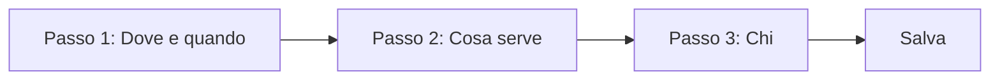

Per gli **eventi non-turno** (ferie, permessi, ecc.) il modale è a schermata
unica, senza i 3 passi.

**Comandi e campi — Passo 1 "Dove e quando"**

| Elemento | Tipo | Cosa fa | Controlli |
|----------|------|---------|-----------|
| Titolo | Campo testo | Titolo dell'evento. | Sistema: obbligatorio ⛔. |
| Tipologia | Menu a tendina | Turno / Chiusura aziendale / Ferie / Permessi / Malattia. Cambia i campi mostrati. | — |
| Filiale | Menu a tendina | Filiale dell'evento (compare con più filiali). | Sistema: deve appartenere all'azienda ⛔. Cambiandola si azzerano reparto evento e reparti dei partecipanti. A video: obbligatoria se multi-filiale. |
| Reparto | Menu a tendina | Reparto dell'evento (Nessuno / Jolly possibile). | Sistema: deve appartenere alla filiale scelta ⛔. |
| Vale per tutte le filiali | Casella | Solo Chiusura aziendale: la rende visibile in ogni filiale. | — |
| Tutto il giorno | Interruttore | Nasconde gli orari; l'evento copre l'intera giornata. | — |
| Data inizio / Data fine | Campi data | Intervallo dell'evento. | A video: entrambe obbligatorie; la fine non può precedere l'inizio ⛔. |
| Orario da / Orario a | Campi ora | Fascia oraria (assenti se "tutto il giorno"). | — |
| Reperibilità | Casella | Marca il turno come on-call. | — |
| Ripeti ogni settimana / Fino al | Casella + data | Imposta una ripetizione settimanale fino alla data indicata. | — |
| ← Indietro / Avanti → / Salta → | Bottoni | Navigano tra i passi. | Per passare dal passo 1 servono filiale (se multi-filiale) e data inizio. |

**Comandi e campi — Passo 2 "Cosa serve"**

| Elemento | Tipo | Cosa fa | Controlli |
|----------|------|---------|-----------|
| Chip mansione | Bottone | Aggiunge una mansione al fabbisogno del turno. | Compare solo se esistono mansioni; altrimenti il passo invita a crearne una ed è saltabile. |
| − / numero / + | Controllo quantità | Imposta quante persone servono per quella mansione. | A 0 la mansione viene rimossa. |
| ✕ (su mansione) | Bottone | Rimuove la mansione dal fabbisogno. | — |
| Avanti → / Salta → | Bottone | Va al passo 3 (diventa "Salta →" se non sono state scelte mansioni). | — |

**Comandi e campi — Passo 3 "Chi"**

| Elemento | Tipo | Cosa fa | Controlli |
|----------|------|---------|-----------|
| Aggiungi / ✓ Aggiunto (dipendente suggerito) | Bottone | Assegna/rimuove un dipendente a una mansione richiesta. | Con mansioni richieste: i dipendenti sono raggruppati per mansione, con stato di disponibilità e contatore copertura. Un dipendente non disponibile non è aggiungibile. |
| Partecipanti / Persone coinvolte | Selezione multipla | Seleziona i partecipanti (quando non ci sono mansioni richieste). | — |
| Orari personalizzati per partecipante | Casella | Mostra i campi orario per singolo partecipante. | Compare solo se non è "tutto il giorno" e ci sono partecipanti. |
| Dalle / Alle / Nota (per partecipante) | Campi ora + testo | Orari e nota individuali; se vuoti vale l'orario del turno. | — |
| Ricorrenza (eventi non-turno) | Menu a tendina | Nessuna / Giornaliera / Settimanale / Mensile. | — |
| Invia notifica | Casella | Marca l'evento come "da notificare". | ℹ️ Vedi nota sotto. |
| Note | Area testo | Note libere sull'evento. | — |
| Elimina | Bottone | Elimina l'evento (solo in modifica). | Chiede conferma. |
| ← Indietro / Annulla / Salva | Bottoni | Navigano, annullano o salvano. | "Salva" disattivato durante il salvataggio. |

> ℹ️ **"Invia notifica"** — la preferenza viene **salvata sull'evento**, ma allo
> stato attuale non risulta una notifica automatica recapitata ai partecipanti
> alla creazione/modifica del turno. Le notifiche realmente recapitate oggi
> riguardano l'**esito delle richieste** (vedi [§12](#12-notifiche-employee)).
>
> ℹ️ **"Ripeti ogni settimana" / "Ricorrenza"** — registra la regola di
> ripetizione sull'evento; la generazione concreta di più occorrenze sul
> calendario si ottiene in modo affidabile con la **clonazione** o la **copia
> settimana**.

### 8.3 Conferma dei conflitti

Dopo il salvataggio di un turno, se ci sono conflitti (vedi
[§9-bis](#9-bis-conflitti-tra-azioni-di-attori-diversi)) il modale resta aperto
e mostra l'elenco.

**Comandi e campi — Riquadro conflitti**

| Elemento | Tipo | Cosa fa | Controlli |
|----------|------|---------|-----------|
| Elenco conflitti | Lista | Mostra i warning rilevati (dipendente + descrizione). | I conflitti **non bloccano** il salvataggio. |
| "Ho letto gli avvisi, procedo comunque" | Casella | Abilita la chiusura del riquadro. | "Chiudi" è disattivato finché non è spuntata. |
| Chiudi | Bottone | Chiude il riquadro; il turno resta salvato. | — |

> Se si modificano gli orari di un turno con orari personalizzati per alcuni
> partecipanti, prima del salvataggio compare una **richiesta di conferma**.

### 8.4 Clonazione di un turno

Dal modale di un turno esistente, l'opzione **"Clona evento in un intervallo"**.

**Comandi e campi — Clonazione**

| Elemento | Tipo | Cosa fa | Controlli |
|----------|------|---------|-----------|
| Clona evento in un intervallo | Casella | Mostra i campi di clonazione. | — |
| Modalità | Menu a tendina | *Giornaliera* (un clone per ogni giorno dell'intervallo) o *Settimanale* (clona la settimana del turno su N settimane). | — |
| Da data / A data | Campi data | Intervallo della clonazione giornaliera. | A video: entrambe obbligatorie. |
| Settimana target / N. settimane | Campo data + numero | Parametri della clonazione settimanale. | N. settimane tra 1 e 52. |
| Clona | Bottone | Esegue la clonazione. | Disattivato durante l'operazione. |

### 8.5 Copia settimana

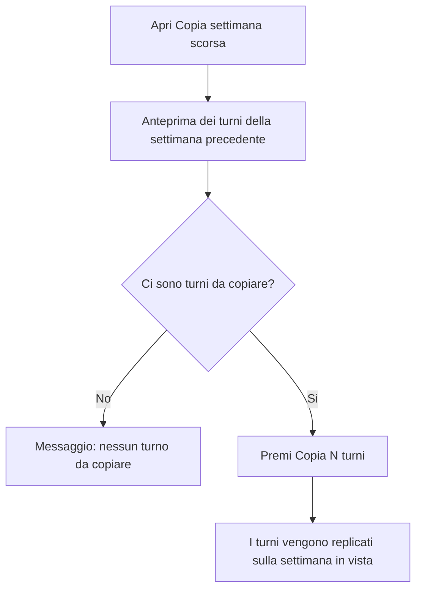

**Comandi e campi — Dialogo Copia settimana**

| Elemento | Tipo | Cosa fa | Controlli |
|----------|------|---------|-----------|
| Anteprima turni | Lista | Elenca i turni della settimana precedente che verranno copiati. | Sola lettura. |
| Annulla | Bottone | Chiude senza copiare. | — |
| Copia N turni | Bottone | Replica i turni sulla settimana in vista. | Disattivato se non ci sono turni da copiare o durante l'operazione. |

> Se la **filiale di destinazione è diversa** da quella d'origine, il reparto dei
> turni copiati viene azzerato (i reparti appartengono alla filiale originale).

### 8.6 Pianificazione (Merchant)

Vista settimanale a griglia: una riga per dipendente, una colonna per giorno.

**Comandi e campi — Pianificazione**

| Elemento | Tipo | Cosa fa | Controlli |
|----------|------|---------|-----------|
| ‹ Settimana precedente / Oggi / Settimana successiva › | Bottoni | Naviga tra le settimane. | — |
| Selettore filiale / reparto | Menu a tendina | Filtra la griglia (con più filiali). | — |
| Cella vuota (+) | Azione | Apre il modale di nuovo turno per quel dipendente e giorno. | — |
| Pillola turno | Azione | Apre il modale di modifica di quel turno. | — |
| Clona a settimana / N. settimane / Clona | Campo data + numero + bottone | Clona la settimana corrente su una o più settimane. | N. settimane tra 1 e 52; serve la settimana target ⛔. |

### 8.7 Pannello "Turni del dipendente"

Aperto da Risorse → "Pianifica turni".

**Comandi e campi — Pannello turni del dipendente**

| Elemento | Tipo | Cosa fa | Controlli |
|----------|------|---------|-----------|
| Calendario settimanale | Vista | Mostra i turni effettivi del dipendente (ferie già sottratte). | — |
| Clic su una data | Azione | Apre il modale di nuovo turno per quel dipendente. | — |
| Clic su un turno | Azione | Apre il modale di modifica. | — |
| + Nuovo turno | Bottone | Crea un turno per il dipendente a partire da oggi. | — |
| Clona settimana | Bottone | Mostra/nasconde i campi di clonazione. | — |
| Settimana sorgente / target / N. settimane / Clona | Campi data + numero + bottone | Clona i turni del dipendente da una settimana a un'altra. | Servono entrambe le settimane ⛔; N. settimane tra 1 e 52. |
| ✕ | Bottone | Chiude il pannello. | — |

### 8.8 Calendario del dipendente (Employee)

Vista in **sola lettura** dei propri turni, ferie/permessi/malattia e chiusure
aziendali.

**Comandi e campi — Calendario Employee**

| Elemento | Tipo | Cosa fa | Controlli |
|----------|------|---------|-----------|
| Oggi / Mese / Settimana / ‹ › | Bottoni calendario | Navigano e cambiano vista. | — |
| Clic su un evento | Azione | Apre il modale di dettaglio (sola lettura). | — |

**Comandi e campi — Modale Dettaglio evento (Employee)**

| Elemento | Tipo | Cosa fa | Controlli |
|----------|------|---------|-----------|
| Chiudi / ✕ | Bottone | Chiude il modale. | — |

Il modale mostra tipo, orari, filiale/reparto, partecipanti, l'eventuale
mansione con cui l'utente partecipa, e le note — tutto in sola lettura.

### Corner case — Eventi e turni

| Situazione | Comportamento |
|------------|---------------|
| Evento "tutto il giorno" | Non ha orari; nei controlli di sovrapposizione vale per l'intera giornata. |
| Chiusura aziendale con "vale per tutte le filiali" | Compare nel calendario di ogni filiale. |
| Dipendente "Jolly" (senza reparto fisso) | Assegnabile a un reparto diverso per ogni turno. |
| Partecipante deselezionato | I suoi orari personalizzati per quel turno vengono scartati. |
| Turno creato in azienda mono-sede | La filiale è assegnata automaticamente alla sede principale. |

---

## 9. Flussi approvativi: richieste

Primo dei due workflow approvativi del sistema: il dipendente **richiede**, il
Merchant **decide**.

### 9.1 Ciclo di vita di una richiesta

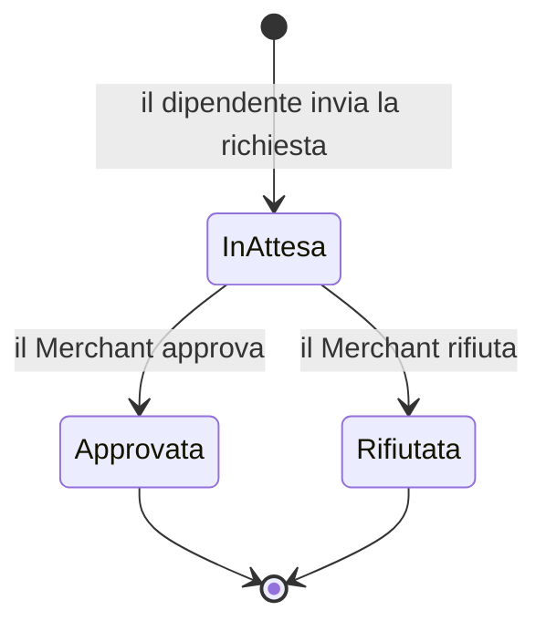

Una richiesta già decisa **non è più modificabile**. Alla decisione, il
dipendente riceve una **notifica** con l'esito.

### 9.2 Creazione richiesta (Employee)

**Comandi e campi — Pagina "Le mie richieste"**

| Elemento | Tipo | Cosa fa | Controlli |
|----------|------|---------|-----------|
| Nuova richiesta / Crea la prima richiesta | Bottone | Apre il modale di creazione. | — |
| Scheda richiesta | Riquadro | Mostra tipo, date, stato, eventuale turno collegato e note. | Sola lettura. |

**Comandi e campi — Modale Nuova richiesta**

| Elemento | Tipo | Cosa fa | Controlli |
|----------|------|---------|-----------|
| Tipo richiesta | Bottoni | Sceglie tra **Ferie / Permesso / Malattia**. | Solo questi tre tipi sono creabili dal dipendente. |
| Data inizio | Campo data | Inizio del periodo richiesto. | A video: obbligatorio. |
| Data fine | Campo data | Fine del periodo (facoltativa). | A video: non precedente all'inizio. |
| Tutto il giorno | Interruttore | Solo per *Permesso*: alterna giornata intera / fascia oraria. | — |
| Dalle / Alle | Campi ora | Fascia oraria del permesso (solo *Permesso*, se non "tutto il giorno"). | A video: l'orario di fine deve essere successivo all'inizio ⛔. |
| Collega a un turno | Menu a tendina | Solo per *Permesso*: aggancia la richiesta a un turno del giorno. | Sistema: il collegamento vale solo se il dipendente partecipa davvero a quel turno. |
| Note | Area testo | Note libere. | — |
| Annulla / Invia richiesta | Bottoni | Annulla o invia. | "Invia" disattivato durante l'invio. |

> *Ferie* e *Malattia* sono **sempre a giornata intera**: per questi tipi il
> toggle orario e il collegamento al turno non compaiono.

### 9.3 Revisione richiesta (Merchant)

**Comandi e campi — Pagina Richieste (Merchant)**

| Elemento | Tipo | Cosa fa | Controlli |
|----------|------|---------|-----------|
| Tab In attesa / Approvate / Rifiutate | Filtri | Filtra le richieste per stato (con conteggio). | — |
| Approva | Bottone (per richiesta in attesa) | Approva la richiesta. | Disattivato durante l'operazione. |
| Rifiuta | Bottone (per richiesta in attesa) | Rifiuta la richiesta. | Disattivato durante l'operazione. |

Alla decisione il dipendente riceve la notifica dell'esito.

### Corner case — Richieste

| Situazione | Comportamento |
|------------|---------------|
| Fascia oraria su Ferie o Malattia | Non applicabile: questi tipi sono sempre a giornata intera. |
| Collegamento a un turno a cui il dipendente non partecipa | Il collegamento viene ignorato; la richiesta resta valida. |
| Dipendente non ancora registrato come account | La decisione viene registrata, ma la notifica non viene recapitata finché non si registra. |
| Richiesta già decisa | Non è più modificabile. |

---

## 9-bis. Conflitti tra azioni di attori diversi

Quando azioni di soggetti diversi si sovrappongono — il caso tipico: **il
Merchant assegna un turno a un dipendente con ferie già approvate** — il sistema
applica la regola **"procedi e segnala"**: il conflitto è un **warning non
bloccante** ⚠️.

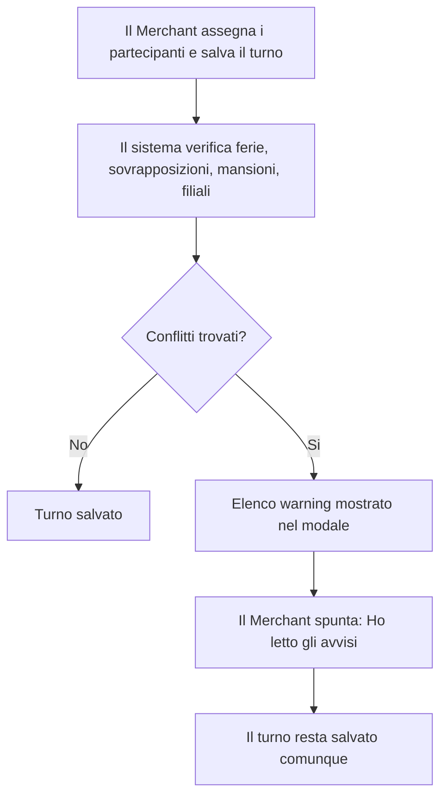

Tipi di conflitto rilevati:

| Conflitto | Quando scatta |
|-----------|---------------|
| **Ferie / permesso / malattia sovrapposti** | Il partecipante ha una richiesta **approvata** che copre la data del turno (per i permessi a ore, solo se le fasce si sovrappongono). |
| **Sovrapposizione di turni** | Il partecipante ha un altro turno lo stesso giorno con orari sovrapposti — anche in filiali diverse. |
| **Mansione mancante** | Il partecipante è assegnato a una mansione che non possiede. |
| **Filiale non abilitata** | Il partecipante è assegnato a una filiale fuori dalle sue filiali abilitate. |

### Schedule effettivo del dipendente

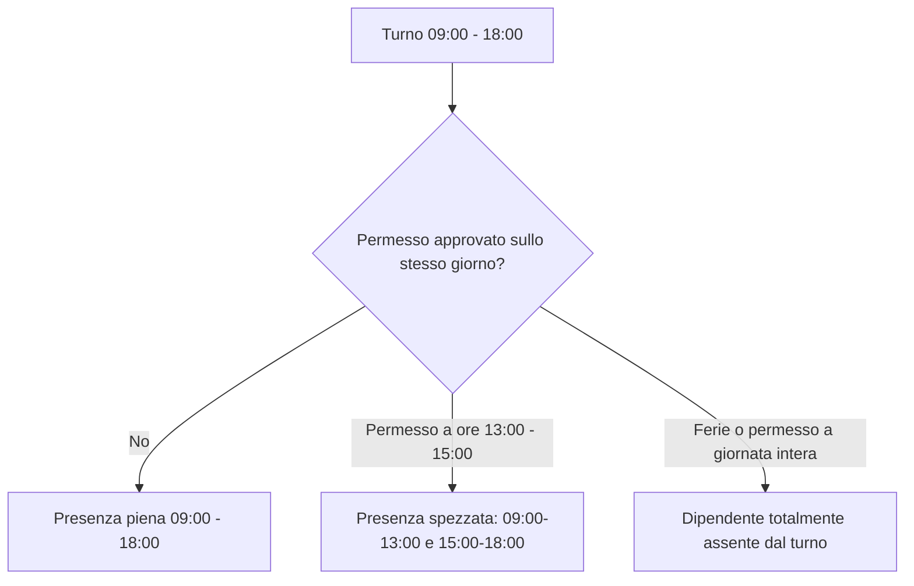

Nei calendari del dipendente e nel pannello "Turni del dipendente", un turno con
ferie sovrapposte appare **spezzato in segmenti di presenza** o marcato
**"assente"**.

### Corner case — Conflitti

| Situazione | Comportamento |
|------------|---------------|
| Turno "tutto il giorno" + permesso a ore | Il turno senza orari è trattato come conflitto pieno con qualunque permesso del giorno. |
| Permesso a ore a metà turno | Il turno viene spezzato in due segmenti di presenza. |
| Prima il turno, poi le ferie | Il warning non compare retroattivamente, ma riappare alla riapertura del turno. |
| Doppio turno in due filiali lo stesso giorno | Segnalato come sovrapposizione. |

---

## 10. Timbratura

Secondo workflow approvativo: il sistema **rileva** un'anomalia, il dipendente
la **giustifica**, il Merchant **decide**.

### 10.1 Configurazione (Merchant)

La pagina Timbratura ha quattro tab: **Configurazione**, **Presenze**,
**Anomalie**, **Report**. In alto un selettore di **filiale** sceglie su quale
filiale agire.

**Comandi e campi — Tab Configurazione**

| Elemento | Tipo | Cosa fa | Controlli |
|----------|------|---------|-----------|
| Timbratura attiva | Interruttore | Abilita la timbratura per la filiale. | Se spento, tutti gli altri campi sono disabilitati. |
| Timbratura obbligatoria | Interruttore | Rende la timbratura obbligatoria anziché facoltativa. | Disabilitato se la timbratura non è attiva. |
| Tolleranza ritardo entrata | Campo numero | Minuti di ritardo entrata tollerati. | Non negativo. |
| Tolleranza uscita | Campo numero | Minuti di uscita anticipata tollerati. | Non negativo. |
| Anticipo massimo entrata | Campo numero | Quanto prima si può timbrare l'entrata. | Non negativo. |
| Ritardo massimo uscita | Campo numero | Margine di uscita posticipata. | Non negativo. |
| Registrazione pause | Interruttore | Abilita la timbratura delle pause. | — |
| Durata massima pausa | Campo numero | Oltre questa durata la pausa genera anomalia. | Disabilitato se le pause non sono attive. |
| Geofencing | Interruttore | Verifica che la timbratura avvenga vicino alla filiale. | — |
| Raggio geofence | Campo numero | Raggio entro cui la timbratura è "in area". | Disabilitato se il geofencing è spento. |
| Latitudine / Longitudine filiale | Campi numero | Coordinate della filiale. | Disabilitati se il geofencing è spento. |
| 📍 Usa la mia posizione attuale | Bottone | Compila le coordinate con la posizione del dispositivo. | Richiede il consenso alla geolocalizzazione del browser. |
| Salva configurazione | Bottone | Salva le impostazioni. | Disattivato durante il salvataggio. Sistema: nessun valore può essere negativo ⛔. |

### 10.2 Timbratura del dipendente (Employee)

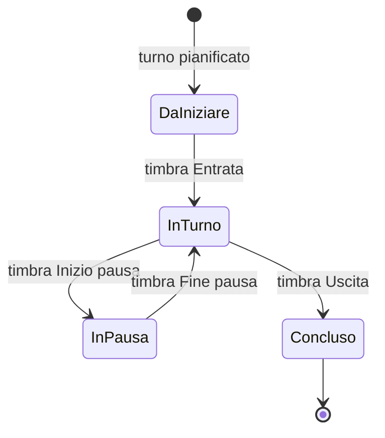

Il dipendente timbra dal **widget** in Dashboard e dalla **pagina Timbratura**.
Il widget mostra un solo pulsante primario, contestuale allo stato.

**Comandi e campi — Widget di timbratura**

| Elemento | Tipo | Cosa fa | Controlli |
|----------|------|---------|-----------|
| Timbra entrata | Bottone primario | Registra l'entrata. | Compare quando il turno è da iniziare. ⛔ Vedi regole di sequenza sotto. |
| Timbra uscita | Bottone primario | Registra l'uscita. | Compare quando si è in turno. |
| Termina pausa | Bottone primario | Chiude la pausa in corso. | Compare quando si è in pausa. |
| Inizia pausa | Bottone secondario | Apre una pausa. | Compare solo mentre si è in turno e non già in pausa. |

> Il widget si **auto-nasconde** se non c'è un turno da timbrare; in Dashboard
> appare solo nell'intorno dell'orario del turno o con un turno in corso. Se il
> geofencing è attivo, al momento della timbratura il browser chiede la
> posizione.

**Regole di sequenza (gate bloccanti ⛔)** — il sistema rifiuta l'azione e
mostra un messaggio:

| Tentativo | Messaggio |
|-----------|-----------|
| Entrata due volte | "Entrata già registrata per questo turno." |
| Uscita senza entrata | "Devi prima timbrare l'entrata." |
| Uscita due volte | "Uscita già registrata per questo turno." |
| Uscita con pausa aperta | "Termina la pausa prima di timbrare l'uscita." |
| Pausa fuori turno | "Devi prima timbrare l'entrata." |
| Seconda pausa con una già aperta | "Hai già una pausa in corso." |
| Fine pausa senza pausa aperta | "Nessuna pausa in corso." |
| Timbratura senza turno pianificato | "È possibile timbrare solo su un turno pianificato." |
| Timbratura su filiale con timbratura disattivata | "La timbratura non è attiva per questa filiale." |
| Pausa con pause non abilitate | "La registrazione delle pause non è attiva per questa filiale." |

**Comandi e campi — Pagina Timbratura (Employee)**

| Elemento | Tipo | Cosa fa | Controlli |
|----------|------|---------|-----------|
| Widget di timbratura | Riquadro | Come sopra. | — |
| Statistiche benessere | Riquadri | Ore della settimana/mese, straordinari; avviso se troppi giorni o ore. | Sola lettura. |
| Giustifica | Bottone (per anomalia aperta) | Apre il modale di giustificazione. | Compare solo per anomalie ancora "Da giustificare". |
| Elenco timbrature | Lista | Storico raggruppato per giorno, con badge "Correzione" e "Fuori area". | Sola lettura. |

### 10.3 Anomalie e ciclo approvativo

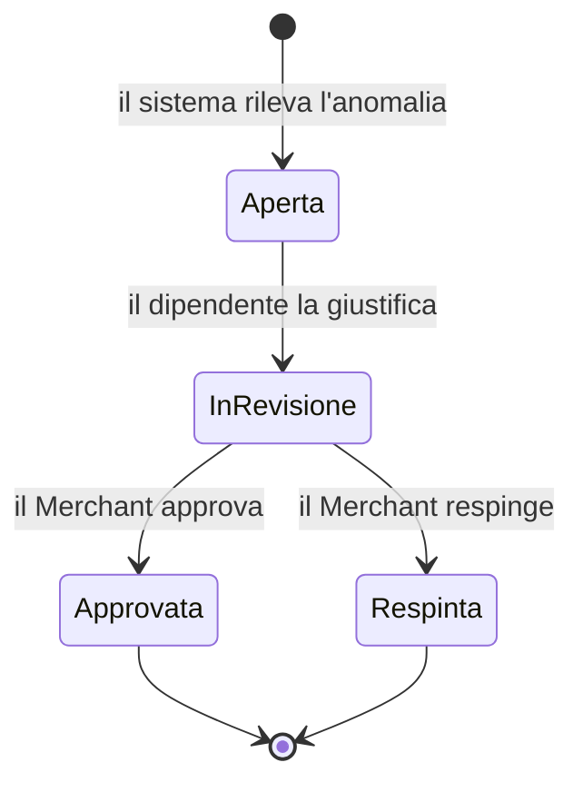

> Nell'interfaccia attuale il Merchant può approvare/respingere un'anomalia
> **solo quando è "In revisione"** (cioè dopo che il dipendente l'ha
> giustificata): un'anomalia ancora "Aperta" non ha i pulsanti di decisione.

**Comandi e campi — Modale Giustifica anomalia (Employee)**

| Elemento | Tipo | Cosa fa | Controlli |
|----------|------|---------|-----------|
| Motivazione | Menu a tendina | Motivo predefinito (traffico, permesso autorizzato, recupero ore, emergenza, dimenticanza, problema tecnico, lavoro da remoto, altro). | — |
| Note | Area testo | Dettaglio facoltativo per il responsabile. | — |
| Annulla / Invia giustificazione | Bottoni | Annulla o invia. | Sistema: la giustificazione è possibile solo se l'anomalia è ancora aperta ⛔. |

**Comandi e campi — Tab Anomalie (Merchant)**

| Elemento | Tipo | Cosa fa | Controlli |
|----------|------|---------|-----------|
| Filtro Stato | Menu a tendina | Filtra per Da giustificare / In revisione / Approvate / Respinte. | — |
| Rileva timbrature mancanti | Bottone | Cerca i turni conclusi senza timbratura e genera le relative anomalie. | Disattivato durante il controllo. |
| Approva | Bottone (per anomalia) | Approva la giustificazione (chiede note facoltative). | Compare solo per anomalie "In revisione". |
| Respingi | Bottone (per anomalia) | Respinge la giustificazione (chiede un motivo facoltativo). | Compare solo per anomalie "In revisione". Sistema: un'anomalia già decisa non è ri-decidibile ⛔. |

### 10.4 Presenze e report (Merchant)

**Comandi e campi — Tab Presenze**

| Elemento | Tipo | Cosa fa | Controlli |
|----------|------|---------|-----------|
| Da / A | Campi data | Intervallo delle timbrature mostrate. | — |
| Tabella timbrature | Lista | Dipendente, tipo, data/ora, turno, scarto, note. | Sola lettura; se l'intervallo include oggi si aggiorna da sola ogni minuto. |

**Comandi e campi — Tab Report**

| Elemento | Tipo | Cosa fa | Controlli |
|----------|------|---------|-----------|
| Da / A | Campi data | Intervallo del report. | — |
| Riepilogo + tabella | Riquadri + lista | Ore lavorate, pause, ore pianificate e straordinari, una riga per turno. | Sola lettura; i turni con anomalia aperta sono evidenziati. |

### Corner case — Timbratura

| Situazione | Comportamento |
|------------|---------------|
| Timbratura fuori area di geofencing | Segnalata come anomalia, **non bloccata**; la tolleranza tiene conto dell'imprecisione del GPS. |
| Pausa oltre la durata massima | Genera un'anomalia di pausa prolungata. |
| Turno a cavallo della mezzanotte | Il turno del giorno prima resta timbrabile finché non si timbra l'uscita. |
| Più turni nello stesso giorno | Viene scelto come "turno corrente" quello più vicino all'orario attuale. |

---

## 11. Magazzino

`Magazzino` è una **funzione RBAC** disponibile sia nell'App Merchant sia
nell'App Employee: un perimetro completo per gestire articoli, stock e acquisti
senza introdurre un secondo sistema di permessi.

Il perimetro comprende:

- articoli di magazzino
- saldo stock per filiale
- ledger movimenti stock
- fornitori
- ordini acquisto
- ricezioni
- report operativi base

Vincoli di prodotto e comportamento del sistema:

- l'unità logistica è la **filiale**; non esiste un'entità separata di warehouse
- la valorizzazione usa solo il **costo medio ponderato**
- ogni rettifica o ricezione scrive un **movimento** e aggiorna il **saldo**
- lo stock negativo non è consentito
- il barcode è un **dato ricercabile**; la scansione camera/device non rientra nel perimetro del modulo
- il dipendente vede solo il perimetro **consultativo / operativo leggero**; non crea articoli, non modifica fornitori e non esegue rettifiche

### 11.1 Accesso e visibilità

- Il **Merchant** vede `Magazzino` in menu e dashboard se la feature è attiva.
- L'**Employee** vede `Magazzino` solo se il suo ruolo include la feature.
- Senza feature, la voce di menu non compare e l'apertura diretta dell'URL riporta alla dashboard (come descritto in [§2](#2-rbac-ruoli-e-gate-di-accesso)).
- Il Merchant può lavorare su **tutte le filiali** o filtrare una filiale specifica.
- L'Employee può lavorare solo sulle filiali a lui consentite: la **filiale primaria** e le eventuali filiali aggiuntive assegnate.

### 11.2 Pagina Magazzino (Merchant)

La pagina Merchant è organizzata in un **header** con filtro filiale e in sei
**tab operative**:
- `Panoramica`
- `Articoli`
- `Movimenti`
- `Fornitori`
- `Ordini acquisto`
- `Report`

**Comandi e campi — Header e tab Magazzino (Merchant)**

| Elemento | Tipo | Cosa fa | Controlli |
|----------|------|---------|-----------|
| Filtro filiale | Select | Mostra dati consolidati su tutte le filiali oppure su una sola filiale. | Se nessuna filiale è selezionata, panoramica e report sono aggregati; le azioni operative che richiedono contesto usano un selettore dedicato. |
| Tab Panoramica / Articoli / Movimenti / Fornitori / Ordini acquisto / Report | Tab | Cambiano la vista operativa del modulo. | Nessun salvataggio automatico allo switch; eventuali modali aperti restano l'unico punto di modifica. |
| Banner di notice / errore | Messaggio inline | Mostra l'esito di azioni come creazione articolo, rettifica, invio ordine, ricezione. | Informativo; visibile solo quando esiste un esito da mostrare. |

### 11.3 Tab Panoramica (Merchant)

La panoramica riassume lo stato del modulo sul filtro attivo. Il Merchant vede:
- numero di articoli attivi
- fornitori attivi
- ordini aperti
- valore totale dello stock
- elenco sintetico dei sotto scorta
- elenco sintetico di ordini aperti e ultimi movimenti

**Comandi e campi — Tab Panoramica**

| Elemento | Tipo | Cosa fa | Controlli |
|----------|------|---------|-----------|
| Stato operativo | Riquadro KPI | Mostra articoli attivi, fornitori attivi, ordini aperti e valore stock. | Sola lettura; riflette il filtro filiale in alto. |
| Sotto scorta | Lista sintetica | Evidenzia gli articoli che richiedono riordino. | Sola lettura; se non ci sono anomalie compare lo stato vuoto. |
| Gestisci ordini | Bottone-link | Porta alla tab `Ordini acquisto`. | — |
| Apri movimenti / Apri report | Bottoni-link | Portano alle tab `Movimenti` e `Report`. | — |

### 11.4 Tab Articoli (Merchant)

La tab Articoli è il catalogo operativo degli SKU. Ogni scheda mostra:
- SKU e nome
- barcode se presente
- unità di misura
- quantità totale
- valore totale
- soglia di riordino
- saldi per filiale

**Comandi e campi — Tab Articoli**

| Elemento | Tipo | Cosa fa | Controlli |
|----------|------|---------|-----------|
| Ricerca SKU / nome / barcode | Campo testo | Filtra il catalogo. | Match testuale case-insensitive lato UI sui dati già caricati. |
| + Nuovo articolo | Bottone | Apre il modale di creazione articolo. | — |
| Modifica | Bottone sulla scheda | Apre il modale di modifica dell'articolo. | — |
| Rettifica stock | Bottone sulla scheda | Porta alla tab `Movimenti` preimpostando l'articolo. | Il contesto filiale viene precompilato dalla prima filiale con saldo o dalla filiale di default. |
| Badge `Disattivo` | Etichetta | Segnala che l'articolo esiste ma non è attivo. | Sola lettura. |

**Comandi e campi — Modale articolo**

| Elemento | Tipo | Cosa fa | Controlli |
|----------|------|---------|-----------|
| SKU | Campo testo | Codice univoco dell'articolo. | Obbligatorio; il sistema rifiuta duplicati nello stesso merchant. |
| Nome | Campo testo | Nome dell'articolo. | Obbligatorio. |
| Barcode | Campo testo | Salva il barcode come dato ricercabile. | Facoltativo; nessuna scansione device. |
| Unità di misura | Campo testo | Imposta l'unità operativa (`pz`, ecc.). | Se vuoto, il sistema usa `pz`. |
| Soglia di riordino | Campo numerico | Soglia di riordino. | Non può essere negativo. |
| Descrizione | Area testo | Note descrittive sull'articolo. | Facoltativa. |
| Articolo attivo | Checkbox | Attiva/disattiva l'articolo (solo in modifica). | Non compare in creazione; un nuovo articolo nasce attivo. |
| Annulla / Salva articolo | Bottoni | Chiudono o salvano il modale. | `Salva` disattivato durante il salvataggio. |

### 11.5 Tab Movimenti (Merchant)

La tab Movimenti ha due funzioni:
- registrare una **rettifica manuale**
- consultare il **ledger cronologico**

La rettifica manuale è l'unica variazione stock inseribile direttamente.
Le ricezioni da ordine acquisto producono movimenti in automatico.

**Comandi e campi — Form rettifica stock**

| Elemento | Tipo | Cosa fa | Controlli |
|----------|------|---------|-----------|
| Filiale | Select | Sceglie la filiale su cui registrare la rettifica. | Obbligatoria; deve appartenere al merchant. |
| Articolo | Select | Sceglie l'articolo da rettificare. | Obbligatorio. |
| Delta quantità | Campo numerico | Inserisce la variazione positiva o negativa. | Obbligatorio; non può essere `0`. |
| Costo unitario | Campo numerico | Imposta il costo della rettifica positiva oppure, se lasciato vuoto, usa il costo medio noto. | Facoltativo sulle rettifiche negative. |
| Reason obbligatoria | Area testo | Motivo della rettifica. | Obbligatoria. |
| Registra rettifica | Bottone | Salva il movimento e aggiorna il saldo. | Disattivato durante il salvataggio; il sistema blocca rettifiche che porterebbero lo stock sotto zero. |

**Comandi e campi — Ledger movimenti**

| Elemento | Tipo | Cosa fa | Controlli |
|----------|------|---------|-----------|
| Tabella movimenti | Lista | Mostra data, tipo, filiale, quantità, valore e dettaglio del movimento. | Sola lettura; riflette il filtro filiale in alto. |

### 11.6 Tab Fornitori (Merchant)

La tab Fornitori contiene la rubrica acquisti del merchant.

**Comandi e campi — Tab Fornitori**

| Elemento | Tipo | Cosa fa | Controlli |
|----------|------|---------|-----------|
| + Nuovo fornitore | Bottone | Apre il modale di creazione fornitore. | — |
| Scheda fornitore | Card | Mostra nome, referente, contatto e partita IVA. | Sola lettura. |
| Modifica | Bottone sulla scheda | Apre il modale di modifica del fornitore. | — |
| Badge `Disattivo` | Etichetta | Segnala che il fornitore esiste ma non è più attivo. | Sola lettura. |

**Comandi e campi — Modale fornitore**

| Elemento | Tipo | Cosa fa | Controlli |
|----------|------|---------|-----------|
| Ragione sociale | Campo testo | Nome del fornitore. | Obbligatorio. |
| Referente / Email / Telefono / P.IVA | Campi testo | Dati di contatto e identificativi. | Tutti facoltativi. |
| Note | Area testo | Informazioni aggiuntive sul fornitore. | Facoltative. |
| Fornitore attivo | Checkbox | Attiva/disattiva il fornitore (solo in modifica). | I fornitori nuovi nascono attivi. |
| Annulla / Salva fornitore | Bottoni | Chiudono o salvano il modale. | `Salva` disattivato durante il salvataggio. |

### 11.7 Tab Ordini acquisto e ricezioni (Merchant)

La tab Ordini acquisto governa il ciclo:
- creazione ordine in `Draft`
- invio ordine
- ricezione parziale o totale
- chiusura automatica quando tutte le righe sono completamente ricevute

Gli stati possibili sono:
- `Draft`
- `Inviato`
- `Parzialmente ricevuto`
- `Chiuso`
- `Annullato`

**Comandi e campi — Tab Ordini acquisto**

| Elemento | Tipo | Cosa fa | Controlli |
|----------|------|---------|-----------|
| + Nuovo ordine | Bottone | Apre il modale di creazione ordine acquisto. | — |
| Badge stato | Etichetta | Mostra lo stato corrente dell'ordine. | Sola lettura. |
| Tabella righe ordine | Lista | Mostra articolo, quantità ordinata, quantità ricevuta e costo. | Sola lettura dentro la scheda ordine. |
| Ricezioni registrate | Lista sintetica | Mostra le ricezioni già effettuate per quell'ordine. | Sola lettura. |
| Invia ordine | Bottone | Porta l'ordine da `Draft` a `Inviato`. | Disponibile solo su ordini `Draft`. |
| Registra ricezione | Bottone | Apre il modale di ricezione. | Disponibile solo su ordini `Inviato` o `Parzialmente ricevuto`. |
| Annulla | Bottone | Annulla l'ordine. | Non disponibile sugli ordini chiusi; il sistema rifiuta l'annullamento se esiste già una ricezione. |

**Comandi e campi — Modale nuovo ordine**

| Elemento | Tipo | Cosa fa | Controlli |
|----------|------|---------|-----------|
| Filiale | Select | Sceglie la filiale destinataria. | Obbligatoria. |
| Fornitore | Select | Sceglie il fornitore dell'ordine. | Obbligatorio; propone fornitori attivi. |
| Consegna prevista | Campo data | Data attesa di ricezione. | Facoltativa. |
| Note | Area testo | Note operative sull'ordine. | Facoltative. |
| Righe ordine | Lista dinamica | Ogni riga definisce articolo, quantità e costo unitario. | L'ordine deve avere almeno una riga; quantità maggiore di `0`; costo non negativo. |
| + Riga / Rimuovi | Bottoni | Aggiungono o rimuovono righe. | L'ultima riga non può essere rimossa se è l'unica presente. |
| Annulla / Crea ordine | Bottoni | Chiudono o creano l'ordine. | `Crea ordine` disattivato durante il salvataggio. |

**Comandi e campi — Modale ricezione**

| Elemento | Tipo | Cosa fa | Controlli |
|----------|------|---------|-----------|
| Riga residua | Riga dati | Mostra solo le righe dell'ordine con quantità ancora da ricevere. | Le righe completamente ricevute non compaiono. |
| Quantità ricevuta | Campo numerico | Inserisce la quantità effettivamente ricevuta. | Deve essere maggiore di `0` e non può superare il residuo della riga ordine. |
| Costo unitario | Campo numerico | Conferma o corregge il costo unitario della ricezione. | Se vuoto usa il costo dell'ordine; non può essere negativo. |
| Note ricezione | Area testo | Note operative sulla consegna. | Facoltative. |
| Annulla / Registra ricezione | Bottoni | Chiudono o registrano la ricezione. | `Registra` disattivato durante il salvataggio. |

Quando una ricezione viene registrata, il sistema:
- crea il documento di ricezione
- aggiorna quantità ricevuta sulle righe ordine
- genera movimenti di tipo `Ricezione acquisto`
- aggiorna i saldi di filiale
- ricalcola il costo medio ponderato dell'articolo
- chiude automaticamente l'ordine se tutte le righe risultano completamente ricevute

### 11.8 Tab Report (Merchant)

La tab Report presenta due viste operative:
- `Valorizzazione stock`
- `Sotto scorta`

**Comandi e campi — Tab Report**

| Elemento | Tipo | Cosa fa | Controlli |
|----------|------|---------|-----------|
| Tabella valorizzazione | Lista | Mostra articolo, filiale, quantità, costo medio e valore. | Sola lettura; usa il filtro filiale in alto. |
| Tabella low stock | Lista | Mostra gli articoli sotto soglia e il riordino suggerito. | Sola lettura; se non ci sono righe compare lo stato vuoto. |

### 11.9 Magazzino del dipendente (Employee)

La versione Employee del modulo è volutamente più stretta: serve per
**consultazione operativa** e priorità di lavoro, non per amministrazione.

Il dipendente può:
- scegliere una delle filiali a lui consentite
- cercare articoli per SKU, nome o barcode
- vedere quantità, valore e soglia di riordino
- vedere articoli sotto scorta
- vedere gli ultimi movimenti

Il dipendente non può:
- creare o modificare articoli
- creare o modificare fornitori
- creare, inviare o annullare ordini acquisto
- registrare rettifiche manuali

**Comandi e campi — Pagina Magazzino (Employee)**

| Elemento | Tipo | Cosa fa | Controlli |
|----------|------|---------|-----------|
| Filiale operativa | Select | Cambia la filiale su cui leggere i dati. | Mostra solo filiali consentite alla membership del dipendente. |
| KPI articoli / sotto scorta / ordini aperti / valore stock | Riquadri | Riassumono il contesto operativo della filiale selezionata. | Sola lettura. |
| Scope operativo | Badge | Mostra la filiale attualmente in consultazione. | Sola lettura. |
| Ricerca SKU / nome / barcode | Campo testo | Filtra gli articoli visibili. | Match testuale lato UI sui dati caricati. |
| Lista stock disponibile | Card list | Mostra articoli, barcode, quantità, valore e soglia. | Sola lettura; evidenzia `Da riordinare` se quantità <= soglia. |
| Sotto scorta | Lista sintetica | Mostra priorità di riordino. | Sola lettura. |
| Ultimi movimenti | Lista sintetica | Mostra tipo movimento, data, filiale e quantità. | Sola lettura. |

### Corner case — Magazzino

| Situazione | Comportamento |
|------------|---------------|
| Utente senza feature `Magazzino` | La voce di menu non compare; l'URL diretto riporta alla dashboard. |
| Merchant con filtro `Tutte le filiali` | Panoramica e report sono aggregati; le azioni operative che scrivono dati richiedono una filiale esplicita nel form. |
| Articolo nuovo senza saldi | Compare nel catalogo con quantità totale a `0` e senza righe saldo. |
| Rettifica negativa che porterebbe lo stock sotto zero | Il sistema rifiuta il salvataggio. |
| Ricezione con quantità superiore al residuo | Il sistema rifiuta il salvataggio. |
| Ricezione finale dell'ultima riga residua | L'ordine passa automaticamente a `Chiuso`. |
| Employee che seleziona una filiale non consentita | Il backend rifiuta la richiesta e la UI mostra un errore. |
| Ricerca barcode | Funziona come ricerca testuale sul valore salvato; non apre la fotocamera e non esegue scansione hardware. |

---

## 12. Notifiche (Employee)

**Comandi e campi — Pagina Notifiche**

| Elemento | Tipo | Cosa fa | Controlli |
|----------|------|---------|-----------|
| Segna tutte come lette | Bottone | Marca tutte le notifiche come lette. | Compare solo se ci sono notifiche non lette; disattivato durante l'operazione. |
| Notifica (clic sull'elemento) | Azione | Marca la singola notifica come letta. | Solo per notifiche non ancora lette. |

Le notifiche effettivamente recapitate oggi riguardano l'**esito delle
richieste** (approvata/rifiutata). Il numero di notifiche non lette compare come
badge sulla campanella e sulla voce di menu.

> ℹ️ Esistono tipi di notifica legati agli eventi/turni, ma allo stato attuale
> non risultano generati automaticamente (vedi nota su "Invia notifica" in
> [§8.2](#82-modale-turno--wizard-a-3-passi)).

---

## 13. Elementi comuni di navigazione

Tutte e tre le app condividono uno schema di navigazione: una **barra laterale**
con le voci di menu e un'**intestazione** in alto.

**Comandi e campi — Barra laterale e intestazione**

| Elemento | App | Cosa fa | Controlli |
|----------|-----|---------|-----------|
| Voci di menu | Tutte | Navigano tra le pagine. | Nell'app Employee compaiono solo le voci abilitate dal ruolo. |
| ☰ (hamburger) | Tutte | Apre/chiude la barra laterale (utile su schermo piccolo). | — |
| Comprimi barra laterale | Admin / Merchant | Riduce la barra laterale a sole icone. | — |
| Campanella notifiche | Employee | Apre la pagina Notifiche; mostra il numero di non lette. | — |
| Cambia azienda | Employee | Torna alla selezione azienda. | Compare solo se il dipendente appartiene a più aziende. |
| Esci / Logout | Tutte | Effettua il logout. | — |

---

## 14. Appendici

### A. Mappa delle funzioni per app

| Area | Admin | Merchant | Employee |
|------|-------|----------|----------|
| Login / recupero password | ✓ | ✓ | ✓ |
| Registrazione | — | ✓ (azienda) | ✓ (dipendente) |
| Selezione / cambio azienda | — | — | ✓ (se multi-azienda) |
| Gestione aziende / approvazione | ✓ | — | — |
| Strumenti (test email, debug) | ✓ | — | — |
| Filiali e reparti | — | ✓ | — |
| Mansioni | — | ✓ | — |
| Risorse / dipendenti | — | ✓ | — |
| Ruoli | — | ✓ | — |
| Calendario / turni | — | ✓ (gestione) | ✓ (sola lettura) |
| Pianificazione | — | ✓ | — |
| Richieste | — | ✓ (revisione) | ✓ (invio) |
| Timbratura | — | ✓ (config, presenze, anomalie, report) | ✓ (timbra, giustifica) |
| Magazzino | — | ✓ (articoli, stock, fornitori, ordini acquisto, ricezioni, report) | ✓ (consultazione/task operativi) |
| Notifiche | — | — | ✓ |

> Funzionalità ancora **non disponibili** (segnaposto): App Admin → *Users*,
> *Reports*; App Merchant → *Documenti*, *Report*; App Employee → *Documenti*.

### B. Glossario

| Termine | Significato |
|---------|-------------|
| **Merchant / Azienda** | Il cliente della piattaforma; ha filiali, reparti e dipendenti. |
| **Filiale (Branch)** | Una sede dell'azienda. La prima è la *sede principale (HQ)*. |
| **Reparto (Department)** | Suddivisione interna di una filiale, con nome e colore. |
| **Sede principale (HQ)** | La filiale designata come sede principale. |
| **Dipendente (Employee)** | Persona che lavora per una o più aziende. |
| **Ruolo** | Insieme di funzioni abilitate, definito dall'azienda. |
| **Funzione** | Una delle 10 aree dell'app abilitabili per ruolo. |
| **Jolly** | Dipendente senza reparto fisso, assegnabile a reparti diversi turno per turno. |
| **Turno** | Evento di lavoro con partecipanti, orari e mansioni. |
| **Mansione / Competenza** | Capacità operativa richiesta su un turno. |
| **Copertura** | Grado di soddisfacimento delle mansioni richieste da un turno. |
| **Conflitto / Warning** | Segnalazione non bloccante su un'assegnazione problematica. |
| **Anomalia** | Irregolarità di timbratura rilevata dal sistema. |
| **Geofencing** | Verifica che la timbratura avvenga in prossimità della filiale. |
| **Controllo a video** | Verifica fatta subito dall'interfaccia. |
| **Controllo del sistema** | Verifica fatta dopo l'invio; se fallisce l'azione è rifiutata. |

### C. Indice dei diagrammi

| Sezione | Diagramma |
|---------|-----------|
| §0 | Gerarchia organizzativa |
| §0 | Mappa dei flussi approvativi |
| §1.2 | Registrazione azienda |
| §1.3 | Registrazione dipendente |
| §1.4 | Selezione azienda |
| §1.5 | Recupero password |
| §2.1 | Visibilità delle funzioni per ruolo |
| §3.2 | Stati di un'azienda |
| §4.2 | Wizard "Configura le filiali" |
| §8.2 | Wizard turno a 3 passi |
| §8.5 | Copia settimana |
| §9.1 | Ciclo di vita di una richiesta |
| §9-bis | Verifica dei conflitti sul turno |
| §9-bis | Schedule effettivo del dipendente |
| §10.2 | Sequenza di timbratura |
| §10.3 | Ciclo di vita di un'anomalia |
